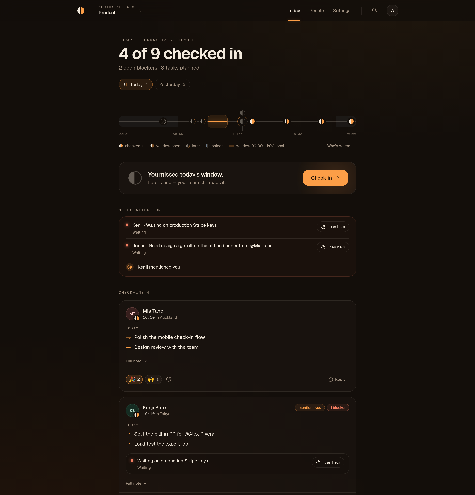
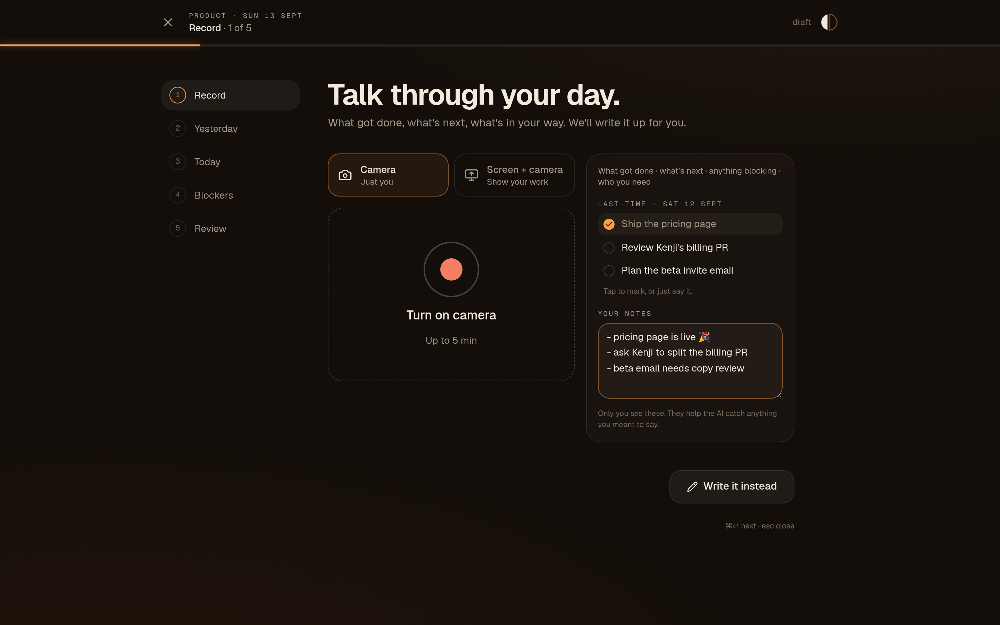
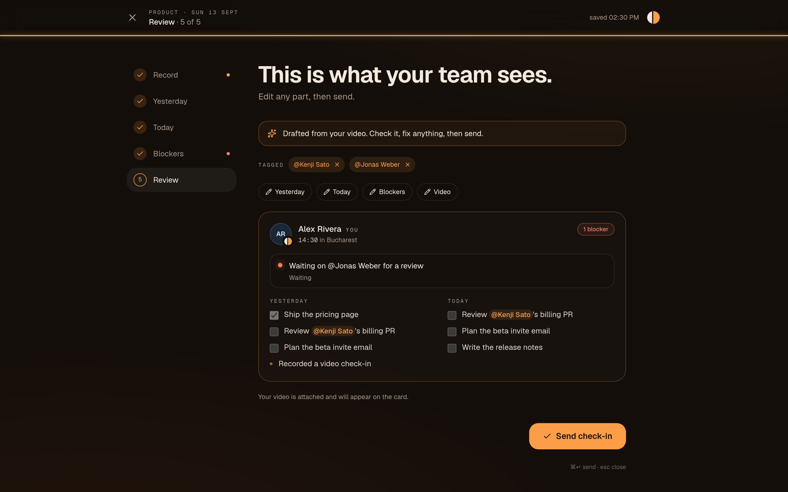
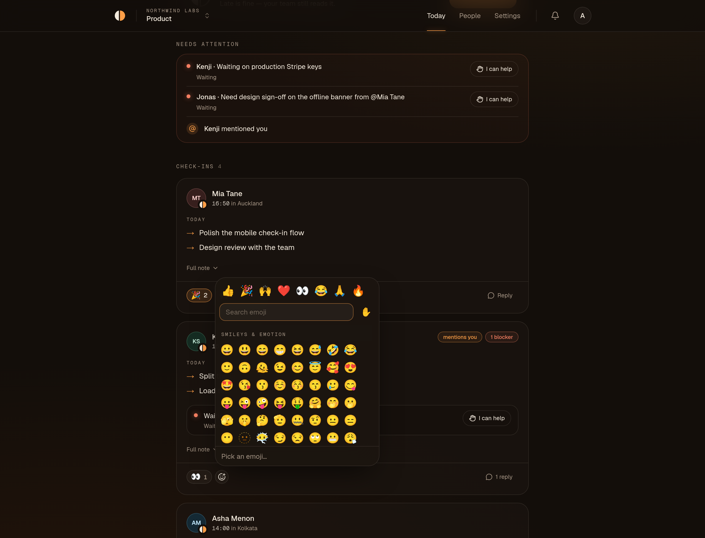
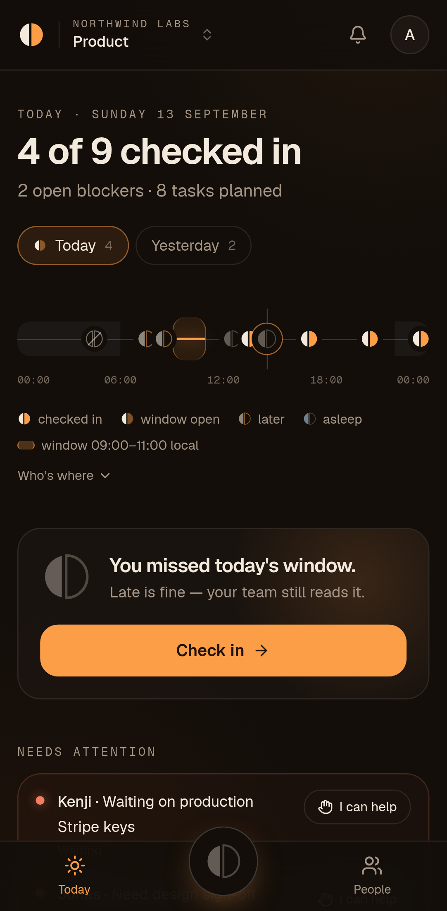
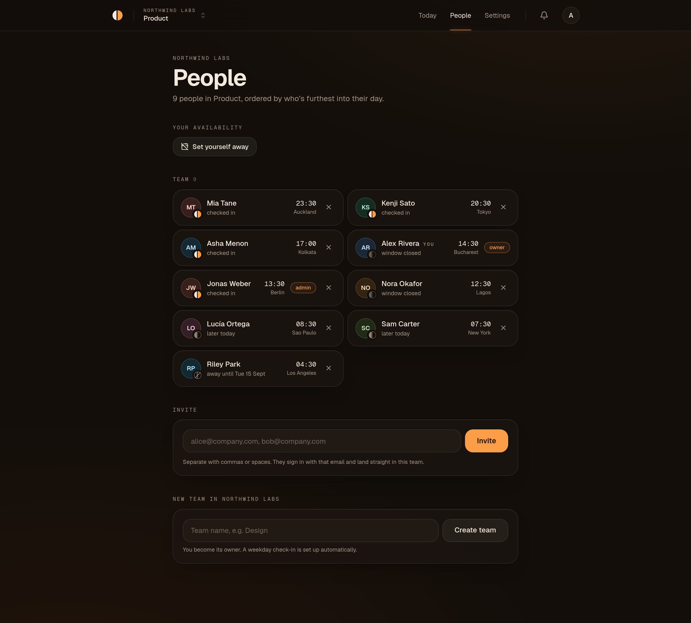
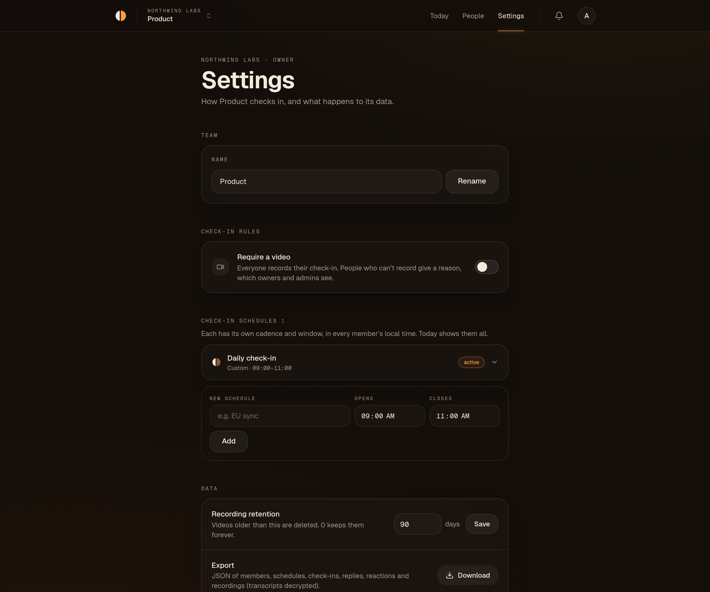

<div align="center">


# Asincly

**Async standups for remote teams.** Talk for two minutes in your own morning; AI writes
the check-in; your team reads it in theirs. No meeting, nothing missed.

[](./LICENSE)
[](https://github.com/codeaz-org/asincly/actions/workflows/ci.yml)
[](./docs/DEPLOYMENT.md#docker-self-host)
[](./CONTRIBUTING.md)

[Features](#features) · [Quick start](#quick-start) · [Deploy for free](#deploy) ·
[Architecture](./docs/ARCHITECTURE.md) · [Contributing](./CONTRIBUTING.md)



</div>

---

## Why

A daily standup at 09:30 in New York is 22:30 in Tokyo and 01:30 in Auckland. Someone is
always awake at the wrong time. Written standups fix that, but nobody likes typing them and
half the context never makes it in.

Asincly lets each person **record a short video whenever their day starts**. The AI turns it
into *yesterday / today / blockers*, ticks off last time's plan, tags the teammates you
mentioned and flags blockers. The team reads a calm, one-screen digest instead of meeting.

## Features

### Record instead of type



- **Video first:** camera or screen + camera, up to 5 minutes; works on phones.
- **Your previous plan on screen while you talk:** tap items as done or still going, or just
  say it.
- **Private notes:** jot talking points beforehand so you don't forget anything.
- **Write it instead:** a guided yesterday → today → blockers flow for days you'd rather type.

### AI writes the check-in



- **Transcription:** Whisper transcribes an audio-only track, so uploads stay small.
- **Uses your plan:** the draft marks last time's tasks **done**, **carries unfinished
  ones forward**, and adds new work and blockers.
- **Auto-tagging:** teammates you mention are tagged automatically; remove a tag with one
  tap before sending.
- **Your words win:** anything you already typed is kept, with a "use AI version" option.
- **Pluggable AI:** Groq by default (free tier). Without a key, videos still upload and
  people write the check-in themselves.

### A dashboard that respects time zones

<table>
<tr>
<td width="62%"></td>
<td></td>
</tr>
</table>

- **Day rail:** everyone placed at *their* local time, with the check-in window as a band.
  You can see who's asleep, who's in their window and who's done.
- **Needs attention:** open blockers with **I can help** / **Resolved**, mentions of you and
  replies to your check-in.
- **Summary-first cards:** full note, video on tap, **Slack-style emoji reactions** and
  replies with `:shortcode:` autocomplete.
- **Not in yet:** see who hasn't checked in, **nudge** people whose window is open, and set
  yourself **away**, which pauses reminders.

### Team rules, people and settings

<table>
<tr>
<td></td>
<td></td>
</tr>
</table>

- **Require video (owners and admins):** members who can't record pick a reason, and
  admins see it.
- **Schedules:** any number per team (daily, weekdays, M·W·F, weekly, custom RRULE). Each
  has a window in every member's local time.
- **Notifications:** in-app and email, for window open, mentions, blockers, replies,
  offers of help and nudges.
- **Data controls:** export everything as JSON, set recording retention, hard-delete a team
  or organization.

### Private by design

- **Tenant isolation in the database:** Postgres **row-level security** on every table.
- **Encryption at rest:** transcripts, summaries and AI drafts are **encrypted**.
- **Media never passes through the app server:** browsers upload with pre-signed URLs and
  play back via short-lived signed links.
- **Hardening:** audit log, rate limits, strict CSP, Zod validation on every input.
- **Open source (AGPL-3.0) and self-hostable** with Docker Compose.

## Quick start

**Prerequisites:** Node.js 22+, [pnpm](https://pnpm.io) 12 (`npm i -g corepack@latest && corepack enable`),
and Docker.

```bash
git clone https://github.com/codeaz-org/asincly.git
cd asincly
pnpm install
cp .env.example .env          # set AUTH_SECRET, DATA_ENCRYPTION_KEY, CRON_SECRET (openssl commands inside)
pnpm db:up                    # Postgres + MinIO in Docker
pnpm db:migrate
pnpm db:seed                  # optional: a demo team across 9 time zones
pnpm dev                      # http://localhost:3000
```

Sign in at <http://localhost:3000/sign-in>. Without a `RESEND_API_KEY`, the magic link is
printed in the terminal running `pnpm dev`. With the demo seed, sign in as
`demo@asincly.local` and open `/northwind/product`.

**AI drafts:** add a free [Groq](https://console.groq.com) key as `GROQ_API_KEY`. To try the
flow without a key, start the dev server with `AI_FAKE=1 pnpm dev` for deterministic
fake drafts.

**Testing on your phone:** cameras need HTTPS. Run `pnpm dev --experimental-https`, and add
your LAN IP to `DEV_ALLOWED_ORIGINS`.

## Deploy

**Can it run for free? Yes.** Two ways, with different trade-offs:

| Option | Cost | Commercial use | Guide |
|---|---|---|---|
| Vercel Hobby + Neon + Backblaze B2 / Cloudflare R2 + Resend + Groq + GitHub Actions | **$0** | ❌ Vercel Hobby is personal use only | [Path A](./docs/DEPLOYMENT.md#a-free-managed-stack-0) |
| Oracle Cloud Always Free VM + Docker Compose | **$0** | ✅ | [Path B](./docs/DEPLOYMENT.md#b-free-vm-with-docker-0) |
| Hetzner CX23 (or any 2 GB VPS) + Docker Compose | **~€5.50/mo** | ✅ | [Path C](./docs/DEPLOYMENT.md#c-cheapest-vps-with-docker-5month) |
| Vercel Pro + Neon + R2 | **~$20+/mo** | ✅ | [Path D](./docs/DEPLOYMENT.md#d-managed-for-companies-20month) |

One-machine self-host with automatic HTTPS:

```bash
cp .env.example .env   # fill in the "Docker self-host" section
docker compose -f docker-compose.selfhost.yml --profile https up -d --build
```

Full guide, limits, CORS and troubleshooting: **[docs/DEPLOYMENT.md](./docs/DEPLOYMENT.md)**.

## Configuration

The essentials. Everything is documented in [`.env.example`](./.env.example).

| Variable | Required | Purpose |
|---|---|---|
| `NEXT_PUBLIC_APP_URL`, `AUTH_URL` | ✅ | Public URL of your deployment |
| `DATABASE_URL` | ✅ | Postgres owner/admin role (migrations, trusted reads) |
| `DATABASE_URL_APP` + `APP_DB_PASSWORD` | ✅ | Non-superuser role subject to row-level security |
| `AUTH_SECRET` | ✅ | Session signing |
| `DATA_ENCRYPTION_KEY` | ✅ | 32-byte base64 key for encrypted transcripts and drafts |
| `S3_*` | ✅ | Any S3-compatible bucket (MinIO, R2, B2, S3) |
| `CRON_SECRET` | ✅ | Protects `/api/cron/tick` (reminders, digests, retention) |
| `RESEND_API_KEY`, `EMAIL_FROM` | Production | Magic-link sign-in and notification emails |
| `GROQ_API_KEY` | Optional | Video transcription and AI drafts |
| `AUTH_GOOGLE_ID`, `AUTH_GOOGLE_SECRET` | Optional | Google sign-in |
| `NEXT_PUBLIC_SOURCE_URL` | If you modify the code | Link to your fork's source (AGPL §13) |

## Tech stack

- **Frontend and app:** Next.js 16 (App Router, React 19, TypeScript strict), Tailwind CSS 4,
  Base UI
- **Data:** Postgres + Drizzle ORM (SQL migrations with FORCE RLS), Auth.js (magic link, Google)
- **Media:** S3-compatible storage with pre-signed uploads (MinIO locally), MediaRecorder
  video and audio
- **AI and email:** Groq (Whisper + Llama) behind a pluggable provider interface; Resend
- **Tests:** Vitest (unit and RLS), Playwright (end-to-end with a fake camera and fake AI)

## Scripts

| Command | What it does |
|---|---|
| `pnpm dev` | Start the app on :3000 |
| `pnpm db:up` / `pnpm db:down` | Start/stop local Postgres + MinIO |
| `pnpm db:migrate` | Apply migrations (and set the app role's password) |
| `pnpm db:seed` | Load the demo workspace (local databases only) |
| `pnpm db:generate` | Create a migration from `src/db/schema.ts` |
| `pnpm db:studio` | Browse the database |
| `pnpm test` | Unit + row-level security tests |
| `pnpm e2e` | Playwright (`AI_FAKE=1 pnpm dev` first; `PW_CHANNEL=chrome` to use installed Chrome) |
| `pnpm lint` / `pnpm typecheck` | ESLint / TypeScript |
| `pnpm emoji:sync` | Refresh the self-hosted emoji dataset |
| `pnpm cron:local` | Fire one scheduler tick against localhost |

## Roadmap

See **[docs/PLAN.md](./docs/PLAN.md)**. Next up:
- Slack app (digest to a channel, DM reminders, `/standup`)
- Branded HTML emails
- Web push / PWA
- Admin 2FA
- More AI providers (OpenAI, Anthropic, local Whisper)

## Contributing

Contributions are welcome — bug reports, docs, translations and code. Read
**[CONTRIBUTING.md](./CONTRIBUTING.md)** for setup, conventions and how tests run. Please
report security issues privately as described in **[SECURITY.md](./SECURITY.md)**.

## License

Copyright © 2026 the Asincly contributors.

Asincly is free software: you can redistribute it and/or modify it under the terms of the
**GNU Affero General Public License v3.0 or later**. See [LICENSE](./LICENSE).

In plain terms:
- **You can:** use it, self-host it for your company, and modify it.
- **If you modify it and offer it to others over a network** (for example as a hosted
  service), you must make your modified source available to those users under the same
  license. Set `NEXT_PUBLIC_SOURCE_URL` to your fork so the in-app "Source code" link
  points to it.
- **Unmodified self-hosting** for your own team has no extra obligations.

Third-party components and their licenses are listed in
[THIRD_PARTY_NOTICES.md](./THIRD_PARTY_NOTICES.md).
